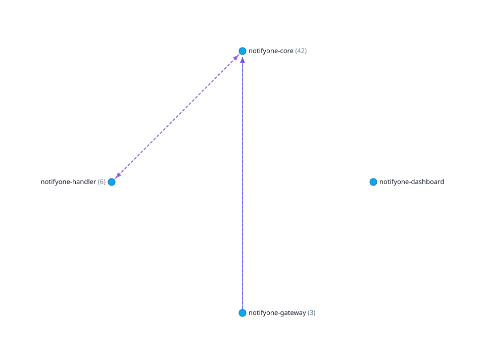

# fleetlens

> **The cross-repo context your coding agent can't grep for.**

[](LICENSE)
[](https://www.python.org/downloads/)
[](ROADMAP.md)
[](https://modelcontextprotocol.io)

Your coding agent can read one repository. Your system is forty of them.

Ask an agent what breaks if you change `POST /orders` and it greps the repository in front of
it, finds nothing, and answers from inference. That failure is hard to spot, because a
confident guess about a service boundary reads exactly like a fact.

fleetlens builds the missing layer. Point it at a folder of service repositories and it derives
the cross-repo service graph: who calls whom over HTTP, who publishes and consumes which
queues, and which endpoint maps to which handler. Then it serves that graph to your agent over
[MCP](https://modelcontextprotocol.io).

### Deterministic first

This is the part that matters, and it is what separates fleetlens from a tool that asks a
model to read your code.

**Parsers, not predictions.** The graph is derived by parsing source: ASTs, routing DSLs and
SCIP call graphs. The same commit always produces the same graph. There is no temperature, no
sampling, and no answer that changes because a model was asked twice. Every fact carries the
file and line it came from and a confidence label, so you can check it.

**Gaps are reported, not filled in.** When a parser cannot resolve a path, it records the site
rather than guessing. A route fleetlens could not read shows up as a number you can act on. A
confident guess about a service boundary is indistinguishable from a fact, which is exactly
the failure this exists to prevent.

**The LLM tier is optional, and it is a tier.** It only ever sees sites the parsers already
recorded as unresolved, it never overrides a deterministic answer, and it must ground what it
proposes in a literal that exists in the repository. Turn it off and you still have the graph.

**Nothing leaves your network.** No API key, no SaaS, no running services, no telemetry. The
deterministic core is local by construction. The optional tiers run against
[Ollama](https://ollama.com) on your own hardware, so even enrichment stays inside the
perimeter. On a private codebase that is usually the difference between shipping this and not.

---

## What it produces

Pointed at the four public [notifyone](https://github.com/orgs/tata1mg/repositories?q=notifyone)
repositories, a real notification system written in Python and TypeScript, with no
configuration:

```
$ fl index-all ./notifyone --db fleet.db
  ok    notifyone-core             623 symbols   567 calls   42 interfaces  10 unresolved
  ok    notifyone-dashboard        334 symbols   256 calls    0 interfaces  48 unresolved
  ok    notifyone-gateway          116 symbols    71 calls    3 interfaces   5 unresolved
  ok    notifyone-handler          262 symbols   188 calls    6 interfaces  10 unresolved
fl index-all: 4/4 indexed into fleet.db (0 skipped) | 4 cross-repo edges (3 async)
```

That's the whole setup. The resulting graph:

```
notifyone-gateway    --calls-------> notifyone-core      [high]
                       /events/custom
                       /notifications/{notification_request_id}
notifyone-gateway    --publishes_to-> notifyone-core     [config]
                       stag-ns_high_priority_event_notification
                       stag-ns_medium_priority_event_notification
                       stag-ns_low_priority_event_notification
notifyone-core       --publishes_to-> notifyone-handler  [config]
                       stag-ns_email_event_notification
                       stag-ns_sms_event_notification
                       stag-ns_push_event_notification
                       stag-ns_whatsapp_event_notification
notifyone-handler    --publishes_to-> notifyone-core     [config]
                       stag-ns_notification_status_update
```

<p align="center">
  
</p>

<p align="center"><em><code>fl export-graph</code> renders the same graph as a self-contained HTML file, with no server.</em></p>

No catalog was written by hand, and nothing ran in production. Every edge carries its evidence
and a confidence label.

In a controlled study on a 16 service codebase, giving an agent this graph reduced fabricated
dependencies from 45 to 6 and roughly halved both tokens and turns. The questions where it did
not help are reported too. See [BENCHMARK.md](BENCHMARK.md).

The `unresolved` column is worth reading. `notifyone-dashboard` is TypeScript and contributed
0 interfaces and 48 unresolved sites. fleetlens is weak on TypeScript and reports that, rather
than returning an empty graph that looks confident. Each site is listed in
`.context/skipped.json` with its file, line and the expression the parser could not read. The
optional LLM tier works from that list, and never guesses outside it.

---

## Quickstart

fleetlens is not on PyPI yet, so install from source:

```bash
git clone https://github.com/tata1mg/fleetlens.git
cd fleetlens
pip install -e "packages/fleetlens[all]"
```

It shells out to a per-language [SCIP](https://github.com/sourcegraph/scip) indexer for the
call graph. Install the ones you need:

```bash
npm install -g @sourcegraph/scip-python @sourcegraph/scip-typescript
```

Index a folder of service repos into one shared SQLite file, then serve it:

```bash
fl index-all /path/to/your/services --db fleet.db
fl serve --db fleet.db
```

Point your MCP client at it over stdio:

```json
{ "mcpServers": { "fleetlens": { "command": "fl", "args": ["serve", "--db", "fleet.db"] } } }
```

Now ask your agent what the orders service exposes, or what breaks if you change
`POST /orders`. It answers from the graph instead of guessing.

To share one index with a team, `fl serve --http` serves the same tools over
streamable-HTTP behind a shared bearer token, with the index opened read-only. See
[docs/deployment.md](docs/deployment.md).

<details>
<summary>Other commands</summary>

```bash
fl index /path/to/repo --db fleet.db     # a single repo instead of a fleet
fl resolve --db fleet.db                 # recompute cross-repo edges
fl export-graph --db fleet.db -o mesh.html   # self-contained HTML render, no server
```
</details>

---

## What your agent gets

| Tool | Answers |
|---|---|
| `list_services` | What services exist in this fleet |
| `list_interfaces` | What does this service expose: routes, queues, and where each came from |
| `get_service_relationships` | Who calls this service, and what it depends on |
| `get_endpoint_call_graph` | Trace an endpoint into the code it actually runs |
| `find_symbol` / `get_symbol` | Locate a function across the fleet |
| `get_callers` / `get_callees` | Blast radius of a change, transitively |
| `discover_services` / `discover_interfaces` | Natural-language search *(opt-in, needs embeddings)* |

---

## How it works

Three layers. Each is optional on top of the one before it, and the first needs no LLM, no API
key and no network.

### 1. Deterministic core

* **Call graph.** A SCIP index (Python, TypeScript) joined to a tree-sitter symbol index.
  Ruby indexes symbols without call edges unless `scip-ruby` is installed.
* **Interface discovery.** HTTP routes read from the AST (FastAPI, Flask, Sanic, Starlette,
  Express) and from the Rails routing DSL, plus queues and topics as described below.
* **Cross-repo resolver.** Each service's outbound calls are matched against the full fleet
  interface inventory, keyed on the request path. No hostname registry is needed because the
  path is the join key, and cross-language edges fall out of this for free.

### 2. Async edges: queues and topics

Services that talk over SQS, SNS, Kafka, RabbitMQ or Celery get `publishes_to` edges as well as
HTTP `calls`. There are two deterministic sources:

* **Code sites.** Calls like `client.send_message(QueueUrl=...)`, `producer.produce(topic, ...)`
  or `consumer.subscribe(...)` on a messaging client, or in a module that imports a messaging
  library. These establish that the service does messaging, and give the direction.
* **Config channels.** Channel-shaped keys (`QUEUE_NAME`, `TOPIC_ARN`, `*_QUEUE`) in
  `config*.json|yaml`, `.env*` or `settings.py`. Direction comes from the key path, so
  `SUBSCRIBE_TO.HIGH.QUEUE_NAME` consumes and `DISPATCH.EMAIL.QUEUE_NAME` publishes. These are
  only trusted when the service also has messaging code, so a stray queue name never becomes an
  edge.

The channel name is the cross-repo join key: a publisher and a consumer of the same channel
in different repos become one edge.

### Rails

Rails declares routes in a DSL rather than per-handler decorators, so the adapter interprets
that DSL. `namespace` and `scope` contribute path prefixes, `resources` expands into the
standard RESTful routes honouring `only:` and `except:`, and `member` and `collection` blocks
nest under the resource with and without its `:id`.

Routes are usually split across files that `config/routes.rb` pulls in with `extend`, so
`config/routes/` is read too. In one production app `config/routes.rb` declared 5 routes and
`config/routes/*.rb` declared 805.

`to: 'orders#index'` is resolved to `app/controllers/orders_controller.rb`, so Rails endpoints
trace into code through `get_endpoint_call_graph` even without a call graph.

### Service addresses from config, and pluggable host resolution

Most fleets keep the address of every service they call in config: `ORDERS_HOST`,
`PAYMENTS_BASE_URL`, `AUTH_SERVICE_ENDPOINT`. That is a twelve-factor convention, not one
team's habit, so extracting those bindings is generic. It is the same mechanism the messaging
adapter already uses for queue names.

Deciding *which* service a host denotes is **not** generic, so it is pluggable. Resolvers are
tried in order, first hit wins:

| Resolver | Handles |
|---|---|
| `ManifestResolver` | explicit `hosts:` mappings in `fleetlens.yaml`, no code needed |
| `KubernetesDNSResolver` | `orders.default.svc.cluster.local` |
| `SlugMatchResolver` | `orders-svc`, `orders_service:8080`, the common default |
| `PortResolver` | `localhost:9402` where another service declares `PORT: 9402` |
| `KeyNameResolver` | `ORDERS_SERVICE.HOST = localhost:...`, where the key names the target |

The last two matter more than they look: development and docker-compose configs address peers
on loopback, so the hostname carries nothing and the **port** or the **key** is the only
signal. A resolver sees the whole binding (key, value, host, port), not just a hostname.

`SlugMatchResolver` is deliberately conservative: it matches whole tokens, so `orders` never
matches `reorders-legacy`, and it refuses known third-party domains outright.

When your addresses follow no pattern a heuristic could infer, declare them. No fork or patch
is needed:

```yaml
# fleetlens.yaml
hosts:
  internal-lb-7.example.com: orders
  "*.payments.internal": payments
```

Or register your own resolver and keep everything else:

```python
from fleetlens.adapters import hosts

class LegacyPrefix:
    name = "legacy"
    def resolve(self, binding, ctx):
        return "orders" if binding.host.startswith("legacy-") else None

hosts.HOST_RESOLVERS.insert(0, LegacyPrefix())
```

An address declared in config is evidence of intent to call, not proof of a call, since a
config may list a host nobody uses. These edges carry `confidence: config`, and are upgraded to
`corroborated` when an observed request path agrees.

### 3. Optional LLM tiers

The parsers only report what they can prove. When a route or queue name is an expression
rather than a string, for example `@bp.route(Model.uri())` or
`sqs.send_message(QueueUrl=self.url)`, the site is recorded rather than guessed, and written
to `.context/skipped.json`.

```bash
ollama pull qwen2.5-coder:7b
fl index <repo> --db fleet.db --fill-gaps   # resolve those sites, and only those
```

Each site gets the snippet plus the definitions it references, and every answer is
**grounded**: a proposed path is accepted only if it exists as a string literal in that repo
(a queue may also resolve through a config key to its value). Anything else is rejected and
recorded as unresolved, with the model's reason. Results are stored as `source="llm"`
alongside the deterministic ones, never replacing them.

Local by default via Ollama, so your code still never leaves the machine. Remote providers
work too (`--provider openai`), and those do send code to an API, which is why they are opt-in.

<details>
<summary>Semantic search (separate opt-in tier)</summary>

```bash
ollama pull bge-m3
fl enrich --db fleet.db                       # summaries + embeddings, only what changed
fl serve  --db fleet.db --embed-model bge-m3  # enables discover_* tools
```
</details>

### Repos ≠ services

One repo is one service by default. When a repo ships several, declare them:

```yaml
# fleetlens.yaml
services:
  - name: orders
    path: services/orders
  - name: billing
    path: services/billing
libraries:                  # code-only paths, never mesh services
  - path: packages/shared
```

A utilities repo that is entirely a library declares only the `libraries` key:

```yaml
# fleetlens.yaml
libraries:
  - path: "."
```

Its code is indexed and `find_symbol` reaches it, but it contributes no service and no
interfaces. That matters because a shared package is not something another service calls
over the network: listing one as a service invents a node nobody deploys, hands it whatever
routes its examples and its own health blueprint happen to declare, and makes "which
services are unused" unreadable.

### Excluding directories

A repo controls what fleetlens reads with a `.fleetlensignore` at its root, one
gitignore-style pattern per line:

```
examples/
fixtures/
generated/
```

This applies everywhere: interfaces, outbound calls, config hosts, symbols and the call
graph. Keys, certificates and credential files are never read whatever the file says, and a
repo can exclude more but cannot opt back in; `SECURITY.md` lists the patterns that always
apply.

---

## How it compares

|  | fleetlens | Sourcegraph / SCIP | Backstage | OpenTelemetry |
|---|---|---|---|---|
| Cross-repo service graph | derived from source | repo-scoped navigation | hand-written YAML | derived from traces |
| Needs running services | no | no | no | **yes** |
| Needs a human-maintained catalog | no | no | **yes** | no |
| Reports what it couldn't determine | **yes** | n/a | no | no |
| Built for agents (MCP) | **yes** | no | no | no |

fleetlens is not a code-search engine, not a service catalog you curate, and not a repo
chatbot. It is the derived graph that sits underneath those.

---

## What it can't do yet

Completeness is not claimed. Gaps are reported instead: `fl index` prints an unresolved-site
count on every run, and `.context/skipped.json` lists each one.

- **Languages:** Python and TypeScript. No Go, Java, or Ruby yet.
- **Frameworks:** FastAPI, Flask, Sanic, Starlette, Express. No NestJS decorators, Django,
  gRPC, or GraphQL.
- **Config-derived hosts:** an outbound call assembled as `urljoin(config_host, endpoint)` is
  recorded as unresolved rather than joined.
- **Dynamically registered consumers** have no handler anchor, so a queue consumer's callback
  isn't linked to its channel.
- **Source-only.** If two services communicate in a way that isn't visible in source, this
  will not see it. That is the deliberate trade for needing nothing at runtime.

## Design principles

1. Deterministic first; LLM optional.
2. Source-only ingestion. Never boot a service.
3. Every fact carries provenance and confidence.
4. Report the gaps instead of guessing.
5. Pluggable producers behind one write contract, so adding a framework never touches the core.

## Security

The default path is local-only: the deterministic core runs entirely on your machine, so
nothing can exfiltrate because nothing leaves. Config is read for structure, never for secret
values, and `.fleetlensignore` is fail-closed. LLM tiers are the only path that can send code
anywhere, they are off by default, and local Ollama keeps even those on-machine. More in
[SECURITY.md](SECURITY.md).

## Contributing

Adding a framework adapter is the highest-leverage contribution and does not touch the core.
See [CONTRIBUTING.md](CONTRIBUTING.md). Bug reports that include the repo shape that confused
a parser are especially welcome.

## Benchmark

[BENCHMARK.md](BENCHMARK.md) reports a controlled study of what changes when an agent gets
fleetlens, including the questions where it did not help and the measured noise floor.

## Roadmap

See [ROADMAP.md](ROADMAP.md).

## License

[Apache-2.0](LICENSE).
